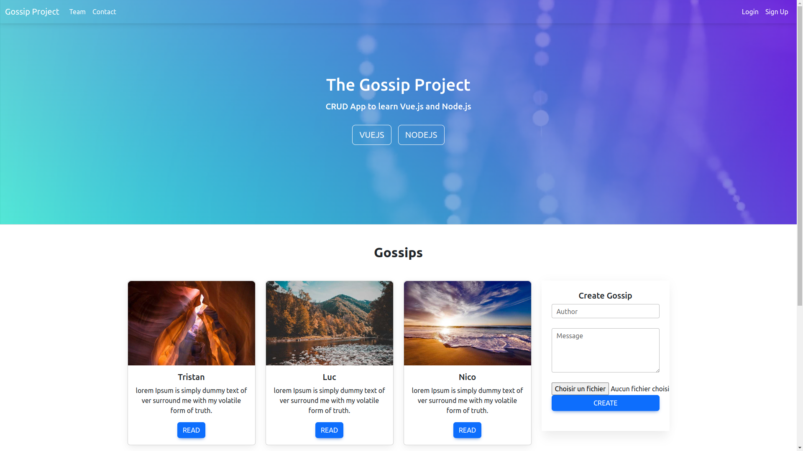

# 🤫 Gossip Project
_CRUD App to learn Vue.js and Node.js_



## 📦 Setup

> Client
```bash
cd ./client
npm i && npm run serve
```
The Vuejs frontend is live on `http://localhost:8080`

> Server
```bash
cd ./server
npm i && node seeds && npm start
```
The backend server is live on `http://localhost:5000`

> Docker
```bash
docker-compose build
docker-compose up
```
The backend server is live on `http://localhost:5000`
The Vuejs frontend is live on `http://localhost:8080`

## 🔑 License

[MIT license](LICENSE)